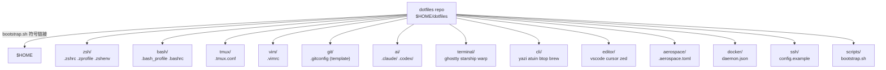

# dotfiles — AI 上下文

> 生成时间：2026-03-31 | 工具：Claude Code /init

## 仓库概述

本仓库以 **包目录（package-style）** 管理 `$HOME` 下的个人配置文件，每个顶层目录对应一个工具域，通过 `scripts/bootstrap.sh` 将文件以符号链接形式还原到当前用户的 `$HOME`。敏感文件（含密钥、token、内网地址）**不纳管**，改以 `.example` 模板保留在仓库中，需在新机器上手动实例化。

## 模块导航

| 模块 | 路径 | 主要功能 |
|------|------|----------|
| zsh | `zsh/` | Zsh 主配置、Oh My Zsh、Powerlevel10k、别名、环境变量 |
| bash | `bash/` | Bash 兼容 shell 配置（fallback） |
| tmux | `tmux/` | tmux 复用器配置 |
| vim | `vim/` | Vim 编辑器配置 |
| git | `git/` | Git 全局模板（sanitized）、全局 .gitignore |
| ai | `ai/` | Claude Code (CCG)、Codex 配置模板与上下文规则 |
| terminal | `terminal/` | Ghostty 终端、Starship 提示符、Warp |
| cli | `cli/` | Homebrew Brewfile、yazi、atuin、btop、neofetch、uv、conda、npm |
| fish | `fish/` | Fish shell 配置：conf.d 模块化（PATH/环境变量/键位/工具/别名/颜色）、Starship 提示符、与 zsh 行为对齐 |
| editor | `editor/` | VS Code / Cursor / Zed 配置、可移植扩展清单 |
| aerospace | `aerospace/` | macOS 平铺窗口管理器（AeroSpace） |
| docker | `docker/` | Docker daemon 配置 |
| ssh | `ssh/` | SSH config 模板（sanitized） |
| julia | `julia/` | Julia startup 与项目环境（仅 startup 参与 home 链接） |
| scripts | `scripts/` | bootstrap.sh 安装脚本、vscode 扩展恢复脚本 |

## 架构图



## 关键文件

- `scripts/bootstrap.sh` — 新机器一键还原所有 symlink
- `scripts/install-vscode-extensions.sh` — 从清单安装 VS Code/Cursor 扩展
- `cli/.config/brewfile/Brewfile` — Homebrew 包清单
- `editor/.vscode/extensions/extensions.list` — 可移植扩展清单（非 runtime state）
- `ai/.claude/CLAUDE.md` — Claude Code 全局规则（symlink 到 `~/.claude/CLAUDE.md`）
- `zsh/.zshrc` — Zsh 主入口
- `README.md` — 全仓概述、symlink 策略、新机还原指南
- `MIGRATION_CHECKLIST.md` — 迁移进度记录
- `PHASE2_AUDIT.md` — 敏感文件审计记录

## 操作指南

### 新机器安装

```bash
git clone <repo> ~/dotfiles
cd ~/dotfiles
./scripts/bootstrap.sh
# macOS 安装 Homebrew 包
brew bundle --file cli/.config/brewfile/Brewfile
# Linux 主机使用原生包管理器，不执行 Brewfile
# 安装 VS Code/Cursor 扩展
./scripts/install-vscode-extensions.sh
./scripts/install-vscode-extensions.sh --code-bin cursor
```

### 新增配置文件

1. 将文件移入对应包目录（保持相对路径）
2. `bootstrap.sh` 会按平台扫描并创建 symlink；Julia 只链接 `startup.jl`
3. 敏感文件改为 `.example` 模板，真实文件保持本地

### 常用命令

```bash
# 预览 bootstrap 操作（不实际执行）
./scripts/bootstrap.sh --dry-run

# 在 Linux 主机上显式预览平台筛选
./scripts/bootstrap.sh --platform linux --dry-run

# 测试还原到临时目录
./scripts/bootstrap.sh --home /tmp/dotfiles-test-home

# 手动重建单个 symlink
ln -sf "$HOME/dotfiles/zsh/.zshrc" ~/.zshrc

# 从备份恢复
rm ~/.zshrc
cp ~/.dotfiles-backup-YYYYMMDD-HHMMSS/.zshrc ~/.zshrc
```

## AI 协作提示

- 修改配置前先 `Read` 对应模块入口文件（见模块导航）
- 所有已纳管的文件都在此仓库中，**不要编辑 `$HOME` 下的 symlink 目标**
- 敏感文件（含 token/密钥）不在仓库中，在本地 `~/.gitconfig`、`~/.ssh/config` 等路径
- `ai/.claude/CLAUDE.md` 是 Claude Code 的全局规则来源，修改它会影响所有项目
- 新模块目录下可创建 `CLAUDE.md` 供 Claude 快速了解该模块
